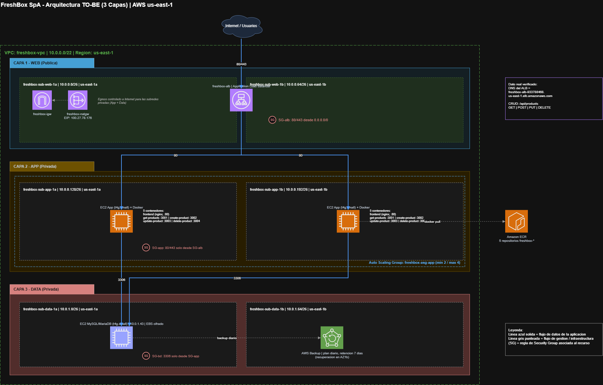

# FreshBox SpA — Arquitectura Cloud de tres capas en AWS

Entregable completo de la **Evaluación Parcial N°1** de ARY1102 (Arquitectura Cloud), Escuela de Informática y Telecomunicaciones, DuocUC.

El caso pide diseñar y desplegar la plataforma de catálogo online de **FreshBox SpA**, una empresa chilena de productos orgánicos con despacho a domicilio que crece un 40% trimestral. Este repositorio contiene el informe técnico, la infraestructura como código, el código de la aplicación y la evidencia del despliegue real en AWS.

El alcance de esta etapa es el **catálogo administrable de productos**. El carrito de compras y el procesamiento de órdenes quedan explícitamente fuera y se abordarán en etapas posteriores.

---

## Arquitectura implementada



Arquitectura de tres capas sobre una VPC `10.0.0.0/22`, con seis subredes /26 distribuidas en dos zonas de disponibilidad de `us-east-1`.

| Capa | Componentes | Aislamiento |
|---|---|---|
| **Web** (pública) | Application Load Balancer `freshbox-alb`, internet-facing en 2 AZs | `freshbox-sg-alb`: 80/443 desde Internet |
| **App** (privada) | 2 × EC2 `t4g.small` bajo Auto Scaling Group `freshbox-asg-app` (mín. 2 / máx. 4), 5 contenedores Docker cada una | `freshbox-sg-app`: solo tráfico cuyo origen es el SG del ALB |
| **Data** (privada) | EC2 `t4g.small` con MariaDB, volumen EBS cifrado, respaldo diario vía AWS Backup | `freshbox-sg-bd`: solo 3306 desde el SG de App |

Servicios de soporte: **Amazon ECR** (5 repositorios de imágenes ARM64), **NAT Gateway** para la salida controlada de las subredes privadas, **AWS Systems Manager Session Manager** para administración sin SSH ni llaves, **AWS Backup** con retención de 7 días y **AWS CloudFormation** para la totalidad de la infraestructura.

**Decisiones de diseño relevantes**

- Los Security Groups se encadenan **referenciando el SG de origen**, no rangos de IP, de modo que las reglas siguen siendo válidas cuando el Auto Scaling Group reemplaza instancias.
- Las instancias usan **AWS Graviton (ARM64)** por relación precio-rendimiento, lo que obligó a construir las imágenes Docker para `linux/arm64` con `docker buildx` y emuladores QEMU.
- La AMI se resuelve dinámicamente vía **SSM Parameter Store**, sin AMI ID fijo en las plantillas.
- Se instaló **MariaDB** en lugar de MySQL Server: es el motor *wire-compatible* disponible nativamente en Amazon Linux 2023, y evita agregar repositorios externos.

---

## Entregables

| Documento | Contenido |
|---|---|
| **[`informe/Informe-EP1-FreshBox-Carlos-Cuevas.pdf`](informe/Informe-EP1-FreshBox-Carlos-Cuevas.pdf)** | Informe técnico entregado: 20 páginas, puntos 1.1 a 1.7, 9 figuras y bibliografía APA v7 |
| [`informe/informe-ep1-freshbox.md`](informe/informe-ep1-freshbox.md) | Fuente versionada del informe, con el mismo contenido que el PDF |
| **[`presentacion/Presentacion-EP1-FreshBox.pptx`](presentacion/Presentacion-EP1-FreshBox.pptx)** | Presentación de defensa: 13 diapositivas de exposición más 3 anexos, con notas del orador y guion de demo |
| [`notas/bitacora.md`](notas/bitacora.md) | Bitácora técnica: identificadores reales de cada recurso, decisiones justificadas, 11 hallazgos mapeados a los pilares Well-Architected y el runbook de redespliegue |
| [`infra/`](infra/) | Las 5 plantillas CloudFormation de toda la arquitectura — ver [`infra/README.md`](infra/README.md) |
| [`codigo/`](codigo/) | Frontend + 4 microservicios Node.js + scripts de despliegue — ver [`codigo/README.md`](codigo/README.md) |
| [`evidencias/`](evidencias/) | 29 capturas de la consola AWS organizadas por etapa — ver [`evidencias/README.md`](evidencias/README.md) |
| [`diagramas/`](diagramas/) | Diagrama de arquitectura TO-BE en `.drawio`, `.xml` y `.png` |

---

## Estructura del repositorio

```
.
├── codigo/                    Aplicación: frontend nginx + 4 microservicios Node.js
│   ├── microservicioFrontend/   HTML/CSS/JS + nginx como reverse proxy interno
│   ├── microserviciosBackend/   get / create / update / delete-product
│   ├── scripts/                 Push a ECR, despliegue de contenedores, user-data
│   ├── docker-compose.yml       Entorno local de prueba
│   └── init.sql                 Esquema y datos iniciales del catálogo
├── infra/                     Infraestructura como código (CloudFormation)
│   ├── 01-red.yaml              VPC, 6 subredes, IGW, NAT Gateway, route tables
│   ├── 02-security-groups.yaml  3 Security Groups encadenados por capa
│   ├── 03-compute.yaml          EC2 MariaDB + Launch Template + Auto Scaling Group
│   ├── 04-alb.yaml              Application Load Balancer + Target Group
│   └── 05-backup.yaml           Vault, plan diario y asignación de recurso
├── evidencias/                Capturas de la consola AWS, por etapa del despliegue
├── diagramas/                 Diagrama de arquitectura TO-BE
├── informe/                   Informe técnico (PDF entregado + fuente Markdown)
├── presentacion/              Presentación de defensa (PowerPoint con notas del orador)
├── notas/bitacora.md          Bitácora técnica y runbook de redespliegue
└── herramientas/              Utilidad para recortar capturas (stdlib, sin dependencias)
```

---

## Reproducir el despliegue

La infraestructura completa se recrea desde cero en unos 15-20 minutos con un solo script:

```bash
git clone https://github.com/carlcuevas/ary1102-freshbox-cloud.git
cd ary1102-freshbox-cloud/infra

./deploy.sh              # VPC, SGs, imágenes ARM64 en ECR, cómputo, ALB y respaldo
./verify.sh --esperar    # comprueba stacks, targets healthy y el catálogo por el ALB
./demo.sh todo           # recorrido de demostración: red, seguridad, HA, CRUD
./teardown.sh            # elimina todo en orden inverso
```

Los scripts filtran los recursos por nombre y no por identificador, así que funcionan igual después de cada redespliegue. El detalle de cada paso, los parámetros de las plantillas y el procedimiento manual equivalente están en **[`infra/README.md`](infra/README.md)**; los comandos exactos del despliegue original, en la sección §10 de [`notas/bitacora.md`](notas/bitacora.md).

Para probar la aplicación en local, sin AWS: `cd codigo && docker compose up -d`.

---

## Hallazgos y brechas declaradas

El informe declara explícitamente las limitaciones del diseño en lugar de presentarlo como cerrado. Resumen de las brechas vigentes y su ruta de mejora (desarrolladas en el punto 1.3 del informe):

| Brecha | Pilar afectado | Mejora propuesta |
|---|---|---|
| ALB sin listener HTTPS (solo puerto 80) | Seguridad | Certificado ACM + listener 443, TLS ≥ 1.2 y redirección 80→443 |
| Contraseña de BD como parámetro del template (`NoEcho`) | Seguridad | AWS Secrets Manager o SSM Parameter Store `SecureString` con rotación |
| NAT Gateway único en `us-east-1a` | Fiabilidad | Un NAT Gateway por AZ, con route table privada por zona |
| Base de datos autoadministrada en EC2, sin réplica | Fiabilidad / Excelencia operativa | Amazon RDS for MySQL Multi-AZ |
| Sin observabilidad (métricas, logs centralizados, alarmas) | Excelencia operativa | CloudWatch Agent, un log group por microservicio, alarmas de 5XX y CPU |
| ASG sin política de escalado dinámico | Eficiencia del rendimiento | Target Tracking Scaling sobre CPU o `RequestCountPerTarget` |
| `HealthCheckType: EC2` en el ASG, no `ELB` | Fiabilidad | Cambiar a `ELB` y apuntar el health check a `/api/products` |
| IP privada de la BD inyectada en el UserData | Fiabilidad | Resolución por DNS privado (Route 53) o endpoint gestionado de RDS |

Durante el desarrollo se detectaron y corrigieron además cuatro defectos reales: el frontend llamaba a puertos fijos en lugar de rutas relativas (habría fallado detrás del ALB), los nombres de contenedor no coincidían con los hostnames que resuelve nginx, las imágenes `amd64` eran incompatibles con las instancias Graviton, y MySQL Server no está disponible en los repositorios de Amazon Linux 2023. Cada uno está documentado con su causa y su mitigación en [`notas/bitacora.md`](notas/bitacora.md).

---

## Despliegue verificado

| | |
|---|---|
| Cuenta AWS | `334767299218` (AWS Academy Learner Lab) |
| Región | `us-east-1` |
| Fecha de verificación | 18 de septiembre de 2026 |
| DNS del balanceador | `freshbox-alb-933788468.us-east-1.elb.amazonaws.com` |
| Validación funcional | CRUD completo (GET/POST/PUT/DELETE) end-to-end a través del ALB |

> **Los recursos ya no existen.** AWS Academy Learner Lab elimina la infraestructura al expirar la sesión del laboratorio, por lo que el DNS y los identificadores citados corresponden al despliegue verificado en la fecha indicada y no a un entorno activo. El repositorio conserva la infraestructura como código y el runbook necesarios para recrear el entorno completo; al hacerlo, los identificadores y el DNS cambian, mientras que los nombres lógicos y los CIDR se mantienen.

---

## Autoría

**Carlos Cuevas** — carl.cuevasn@duocuc.cl · Sección ARY1102 · Docente: Rodrigo Horacio Aguilar González

La aplicación de catálogo fue entregada como base por la asignatura — diseñador: Ignacio A. Pastenet M. El trabajo de arquitectura cloud, la infraestructura como código, la corrección de los defectos del código, el despliegue en AWS y la documentación corresponden a este entregable.

Material académico desarrollado para DuocUC. Las credenciales presentes en el código y en las plantillas son de laboratorio, no productivas; su gestión adecuada está declarada como brecha de seguridad en el informe.
