# DuocUC

### Escuela de Informática y Telecomunicaciones

## ARY1102 — Arquitectura Cloud

### Evaluación Parcial N°1

# Informe Técnico: Arquitectura Cloud para FreshBox SpA

*Plataforma de catálogo online de productos orgánicos sobre AWS*

**Estudiante:** Carlos Cuevas
**Correo institucional:** carl.cuevasn@duocuc.cl
**Sección:** ARY1102
**Docente:** Rodrigo Horacio Aguilar González
**Fecha de entrega:** 22 de septiembre de 2026

**Repositorio del proyecto:** github.com/carlcuevas/ary1102-freshbox-cloud

> **Nota sobre este archivo.** Esta es la fuente versionada del informe, con el mismo contenido que el documento entregado en [`Informe-EP1-FreshBox-Carlos-Cuevas.pdf`](Informe-EP1-FreshBox-Carlos-Cuevas.pdf). El PDF es la versión formal de entrega —con portada, índice paginado, figuras insertadas y numeración—; este Markdown existe para poder versionar, revisar y diferenciar el texto en Git. Las rutas de las imágenes son relativas a la raíz del repositorio.

---

# Índice

1. Introducción
2. Desarrollo
   - 1.1 Rol del Arquitecto Cloud
   - 1.2 Pilares del AWS Well-Architected Framework
   - 1.3 Análisis de la Arquitectura según Well-Architected
   - 1.4 Priorización de Requerimientos
   - 1.5 Comparación de Modelos de Nube
   - 1.6 Justificación del Modelo Cloud Seleccionado
   - 1.7 Validación del Diseño
3. Conclusiones
4. Bibliografía

**Índice de figuras**

- Figura 1. Arquitectura TO-BE de FreshBox SpA (3 capas, us-east-1)
- Figura 2. Detalle de `freshbox-vpc`: CIDR 10.0.0.0/22, estado Available
- Figura 3. Target Group `freshbox-tg-app` con 2 targets healthy en AZs distintas
- Figura 4. Instancias EC2 del despliegue y su pertenencia al Auto Scaling Group `freshbox-asg-app`
- Figura 5. Plan de respaldo diario `freshbox-backup-plan-mysql`
- Figura 6. Los 5 repositorios de imágenes en Amazon ECR
- Figura 7. Route table privada y NAT Gateway
- Figura 8. Security Groups de las capas App y Data
- Figura 9. Validación CRUD end-to-end a través del ALB

---

# Introducción

FreshBox SpA es una empresa chilena que vende productos orgánicos y saludables —frutas, verduras, snacks y bebidas naturales— con despacho a domicilio en la Región Metropolitana. Su demanda crece a un ritmo de 40% trimestral, lo que equivale a multiplicar la carga por aproximadamente 3,8 veces en un año (1,4⁴ ≈ 3,84). Ese patrón de crecimiento hace inviable dimensionar infraestructura fija: sobredimensionar inmoviliza capital y subdimensionar provoca caídas del servicio justo cuando más ventas hay en juego.

Este informe documenta el trabajo de arquitectura cloud realizado para la primera etapa del proyecto: un catálogo online administrable de productos. El carrito de compras y el procesamiento de órdenes quedan explícitamente fuera de este alcance y se abordarán en etapas posteriores. La organización declaró cinco necesidades para esta etapa: visualización de productos, administración de productos, escalabilidad automática, alta disponibilidad y optimización operacional y financiera.

A diferencia de un ejercicio teórico, la arquitectura descrita en este documento fue efectivamente desplegada y verificada en una cuenta de AWS Academy Learner Lab (cuenta 334767299218, región us-east-1): una arquitectura de tres capas —Web, App y Data— sobre una VPC 10.0.0.0/22 con seis subredes distribuidas en dos zonas de disponibilidad, con un Application Load Balancer, dos instancias EC2 `t4g.small` ejecutando cinco contenedores Docker cada una bajo un Auto Scaling Group, imágenes gestionadas en Amazon ECR, una instancia EC2 con MariaDB en la capa de datos, respaldo automatizado con AWS Backup, y Security Groups encadenados por capa. Toda la infraestructura fue definida como código mediante cinco plantillas de AWS CloudFormation, y el CRUD completo de productos (GET/POST/PUT/DELETE) fue validado de extremo a extremo a través del DNS público del balanceador, como se detalla en el punto 1.7.

El documento se organiza en siete puntos: el rol del arquitecto cloud en este proyecto (1.1), los pilares del AWS Well-Architected Framework aplicados al caso (1.2), el análisis de riesgos y oportunidades de mejora según ese marco (1.3), la priorización de los 18 requerimientos técnicos y de negocio del proyecto (1.4), la comparación entre modelos de nube (1.5), la justificación del modelo cloud seleccionado en sus dimensiones técnica, financiera y estratégica (1.6), y la validación del diseño en alta disponibilidad, escalabilidad y buenas prácticas, con una tabla de trazabilidad requerimiento-evidencia (1.7). Cada afirmación conceptual se ancla a un recurso, un identificador o un hallazgo real del despliegue; las brechas conocidas del entorno académico —ausencia de HTTPS, un solo NAT Gateway, falta de observabilidad y una base de datos autoadministrada— se declaran explícitamente junto con su recomendación de mejora.

La Figura 1 resume esta arquitectura de destino (TO-BE).

*Figura 1. Arquitectura TO-BE de FreshBox SpA, 3 capas sobre AWS (región us-east-1), con vista de red y de flujo de tráfico. Elaboración propia. Fuente: `diagramas/diagrama-arquitectura-tobe.png`.*

---

# Desarrollo

## 1.1 Rol del Arquitecto Cloud

El arquitecto cloud es quien traduce los objetivos de negocio en una arquitectura técnica sostenible: define la estructura, los estándares y las restricciones de la solución, y actúa como puente entre la dirección de la empresa y los equipos que implementan. Su valor está en que cada decisión de infraestructura pueda justificarse frente a una necesidad del negocio.

En el proyecto FreshBox, ese rol se ejerció de manera concreta y verificable, como resume la siguiente tabla.

| Responsabilidad técnica | Cómo se ejerció en este proyecto |
|---|---|
| Diseño de topología de red y aislamiento | VPC `freshbox-vpc` (10.0.0.0/22) segmentada en 3 capas y 6 subredes /26 distribuidas en us-east-1a y us-east-1b |
| Definición del modelo de seguridad perimetral | 3 Security Groups encadenados por referencia de SG de origen (`freshbox-sg-alb` → `freshbox-sg-app` → `freshbox-sg-bd`), no por rango de IP |
| Selección de servicios y tipo de instancia | `t4g.small` (familia Graviton/ARM64) para las 3 instancias EC2, por su relación precio-rendimiento |
| Definición de la estrategia de despliegue | Contenedores Docker + Amazon ECR (5 repositorios) + aprovisionamiento automatizado vía UserData |
| Estandarización y reproducibilidad | Infraestructura completa como código: 5 stacks de AWS CloudFormation (`freshbox-red`, `-sg`, `-compute`, `-alb`, `-backup`) |
| Gestión de riesgos técnicos | Detección y corrección de defectos del código de la aplicación (rutas de API y resolución de hostnames Docker) antes de desplegar en AWS |
| Adaptación a restricciones institucionales | Reutilización de `LabRole` / `LabInstanceProfile` ante la imposibilidad de crear roles IAM nuevos en AWS Academy Learner Lab |

Junto con lo técnico, el rol tuvo un componente estratégico: alinear la capacidad de la plataforma con la meta de crecimiento del 40% trimestral sin comprometer capital, definir un modelo de costos operacional, gestionar el riesgo de continuidad del servicio mediante alta disponibilidad Multi-AZ y respaldos automatizados, y dejar una base evolutiva —la VPC /22 desplegada en esta etapa tiene espacio de direccionamiento libre para que carrito y órdenes se agreguen sin rediseñar la topología.

La siguiente tabla vincula explícitamente cada decisión de arquitectura con el objetivo de negocio que atiende y con un resultado medible en el despliegue.

| Objetivo del negocio | Decisión de arquitectura | Resultado medible |
|---|---|---|
| Soportar 40% de crecimiento trimestral | Auto Scaling Group `freshbox-asg-app` (mín. 2 / máx. 4) | Capacidad duplicable sin intervención humana |
| Continuidad del servicio | ALB + 2 AZs + Auto Scaling Group con health check de instancia | Reemplazo automático de instancias ante falla de instancia, observado en el despliegue (ver 1.7) |
| Optimización financiera | `t4g.small` (Graviton) + pago por uso + elasticidad | Sin inversión en hardware; se paga solo la capacidad usada |
| Protección de la información | Cifrado EBS + 3 capas + BD sin ruta desde Internet | `freshbox-sg-bd` solo acepta 3306 desde `freshbox-sg-app` |
| Agilidad para etapas futuras | Microservicios en contenedores + Amazon ECR | Agregar el servicio de carrito no exige tocar la red ni la BD |
| Reducir riesgo operacional humano | IaC (CloudFormation) + AWS Systems Manager Session Manager | Entorno reproducible en 15–20 min; cero llaves SSH expuestas |

## 1.2 Pilares del AWS Well-Architected Framework

El AWS Well-Architected Framework es un cuerpo de buenas prácticas arquitectónicas organizado en seis pilares: excelencia operativa, seguridad, fiabilidad, eficiencia del rendimiento, optimización de costos y sostenibilidad (Amazon Web Services, s.f.-a). A continuación se describe cada pilar junto con su aplicación concreta en el despliegue de FreshBox y la necesidad del caso que atiende, evitando ejemplos genéricos.

### Excelencia operativa

Toda la infraestructura está definida como código en 5 plantillas de AWS CloudFormation (`01-red`, `02-security-groups`, `03-compute`, `04-alb`, `05-backup`), lo que permite un despliegue reproducible y auditable en lugar de una configuración manual (Amazon Web Services, s.f.-k). La AMI de las instancias se resuelve dinámicamente vía SSM Parameter Store, sin un AMI ID fijo en el código; el aprovisionamiento de la base de datos y de los 5 contenedores está automatizado por UserData; y la administración se realiza exclusivamente por AWS Systems Manager Session Manager, sin SSH ni llaves. Esto atiende directamente la necesidad de "optimización operacional": el entorno completo se recrea de forma reproducible en 15–20 minutos, como demuestra el runbook de redespliegue de la bitácora técnica del proyecto.

### Seguridad

La red está segmentada en 3 capas con Security Groups encadenados: `freshbox-sg-alb` acepta tráfico público en los puertos 80 y 443; `freshbox-sg-app` solo acepta tráfico cuyo origen es `freshbox-sg-alb`; `freshbox-sg-bd` solo acepta el puerto 3306 desde `freshbox-sg-app`. Cabe precisar que el Security Group del balanceador permite el puerto 443, pero el ALB no tiene listener HTTPS configurado en esta etapa: el puerto está habilitado a nivel de red para cuando se incorpore el certificado, brecha que se declara en los puntos 1.3 y 1.7. Lo mismo ocurre con `freshbox-sg-app`, que también acepta el puerto 443 desde `freshbox-sg-alb` aunque nginx escucha solo en el puerto 80: es una regla preparada para el futuro certificado, dentro de la misma brecha de HTTPS. Al referenciar el Security Group de origen en lugar de un rango de IP, la regla se mantiene válida aunque el Auto Scaling Group reemplace instancias (Amazon Web Services, s.f.-b). Los volúmenes EBS de las capas App y Data están cifrados, la base de datos no tiene ruta de entrada desde Internet, y el rol IAM de las instancias tiene permiso de solo lectura sobre ECR. Esto atiende la necesidad de proteger la información del catálogo.

### Fiabilidad

El despliegue es Multi-AZ (us-east-1a y us-east-1b) en las tres capas; el Application Load Balancer distribuye tráfico entre 2 subredes públicas mediante un Target Group cuyo health check HTTP en `/` exige 2 comprobaciones exitosas para marcar un target como healthy (Amazon Web Services, s.f.-g); el Auto Scaling Group mantiene un mínimo de 2 instancias; y AWS Backup ejecuta un plan diario con retención de 7 días sobre la instancia de base de datos (Amazon Web Services, s.f.-i). Según la bitácora técnica, el Auto Scaling Group reemplazó automáticamente las instancias App originalmente lanzadas por el grupo. Las nuevas quedaron en estado healthy con sus 5 contenedores operativos, como se detalla en el punto 1.3. Esto atiende directamente la necesidad de "alta disponibilidad".

### Eficiencia del rendimiento

Las tres instancias EC2 usan procesadores de la familia AWS Graviton (ARM64) en el tipo `t4g.small`. Según la documentación oficial, la familia Graviton reporta hasta un 20% menos de costo frente a instancias x86 comparables y hasta un 60% menos de consumo energético para el mismo rendimiento (Amazon Web Services, s.f.-c); estas cifras corresponden a la familia de procesadores en general y no son exclusivas de la generación usada en este despliegue. El ALB distribuye la carga entre las dos zonas de disponibilidad, y nginx actúa como reverse proxy dentro de cada instancia App, enrutando cada solicitud al microservicio correspondiente según el método HTTP sin saltos de red adicionales. Esto sostiene el crecimiento de la demanda sin degradar la experiencia del usuario.

### Optimización de costos

No existe inversión en servidores ni en centro de datos propio; la familia Graviton reduce el costo por hora frente a su equivalente x86; el Auto Scaling Group está dimensionado en el mínimo necesario para alta disponibilidad (2) con un techo controlado (4); y esta etapa usa una sola instancia de base de datos, coherente con que el alcance actual es solo catálogo, sin transacciones de compra. Esto atiende la necesidad de "optimización financiera".

### Sostenibilidad

El uso de procesadores Graviton —más eficientes en consumo energético por unidad de trabajo según la documentación de AWS (Amazon Web Services, s.f.-c)—, el right-sizing deliberado en `t4g.small`, la densidad de 5 microservicios por instancia en lugar de 5 servidores separados, y la elasticidad que libera capacidad cuando no se necesita, alinean la infraestructura con la identidad de una empresa de productos orgánicos que declara la sostenibilidad como parte de su propuesta de valor.

## 1.3 Análisis de la Arquitectura según Well-Architected

Durante el desarrollo y el despliegue se detectaron varios riesgos que ya fueron mitigados, lo que respalda la credibilidad del análisis: el frontend llamaba originalmente a puertos fijos (3001–3004) en lugar de rutas relativas, lo que habría fallado detrás del ALB porque las instancias App están en subred privada y el balanceador solo expone 80/443; se corrigió migrando a la ruta relativa `/api/products` con nginx como reverse proxy interno. Los nombres de los contenedores no coincidían con los hostnames que nginx resuelve internamente; se corrigió agregando `--network-alias` en el despliegue. Las imágenes construidas en amd64 resultaron incompatibles con las instancias Graviton (ARM64); se resolvió con un build multiplataforma usando emuladores QEMU y `docker buildx`. Y Amazon Linux 2023 no incluye el paquete oficial de MySQL Server en sus repositorios, por lo que se instaló MariaDB, motor wire-compatible con MySQL y disponible nativamente, evitando agregar repositorios externos.

Más allá de lo ya mitigado, el análisis identificó riesgos vigentes y oportunidades de mejora concretas de esta arquitectura, no observaciones genéricas de manual. Se organizan por pilar en la siguiente tabla.

| Riesgo / oportunidad | Pilar | Recomendación específica |
|---|---|---|
| El ALB no tiene listener HTTPS (solo puerto 80); el tráfico viaja sin cifrar | Seguridad | Emitir certificado en AWS Certificate Manager, agregar listener 443 con política TLS ≥ 1.2 y redirección 80→443 |
| La contraseña de la base de datos vive como parámetro del template (mitigado con `NoEcho`, pero presente en texto plano en tiempo de ejecución) | Seguridad | Migrar a AWS Secrets Manager o SSM Parameter Store SecureString, con rotación automática |
| Un solo NAT Gateway (`freshbox-natgw`), ubicado en us-east-1a: si esa AZ falla, ambas subredes privadas pierden salida a Internet | Fiabilidad | Desplegar un NAT Gateway por AZ, con una route table privada por zona (Amazon Web Services, s.f.-d) |
| Base de datos autoadministrada en EC2, solo existente en la subred de la AZ 1a: parches, respaldos y un eventual failover dependen del equipo | Fiabilidad / Excelencia operativa | Migrar a Amazon RDS for MySQL Multi-AZ: failover automático, respaldos y parches gestionados (Amazon Web Services, s.f.-e) |
| Sin observabilidad: no hay métricas de aplicación, logs centralizados de los contenedores ni alarmas | Excelencia operativa / Fiabilidad | Instalar CloudWatch Agent, un log group por microservicio, y alarmas sobre `UnHealthyHostCount`, `HTTPCode_ELB_5XX_Count` y CPU del ASG |
| El Auto Scaling Group no tiene política de escalado dinámico: el rango mín. 2 / máx. 4 existe, pero ninguna regla lo activa automáticamente | Eficiencia del rendimiento / Fiabilidad | Definir Target Tracking Scaling (p. ej., CPU promedio 60% o `RequestCountPerTarget`) |
| El ASG opera con `HealthCheckType: EC2`, que evalúa solo el estado de la instancia. Un target marcado unhealthy por el Target Group del ALB no dispara por sí solo su reemplazo | Fiabilidad | Cambiar el `HealthCheckType` del ASG a `ELB`, y apuntar el health check del Target Group a un endpoint de aplicación real (`/api/products`) en lugar de la raíz `/` (Amazon Web Services, s.f.-h) |
| Amazon ECR sin política de ciclo de vida: las imágenes se acumulan indefinidamente bajo el tag `latest` | Optimización de costos | Configurar una lifecycle policy que conserve las N imágenes más recientes y expire las untagged (Amazon Web Services, s.f.-j) |
| El frontend se sirve desde las instancias EC2, sin caché de borde | Eficiencia del rendimiento / Costos | Publicar los estáticos vía Amazon CloudFront, reduciendo carga y latencia |
| Sin protección perimetral de capa 7 en el ALB | Seguridad | Asociar AWS WAF al ALB con reglas gestionadas contra inyección SQL y bots |
| La IP privada de la base de datos se inyecta en el UserData al crear el stack: si la instancia de datos se recrea, las instancias App quedan apuntando a una IP que ya no existe | Fiabilidad / Excelencia operativa | Resolver la base de datos por nombre (Route 53 privado) o por endpoint gestionado de RDS, en lugar de por IP |

### Hallazgo destacado: los dos niveles de salud del Auto Scaling Group

El Auto Scaling Group opera con `HealthCheckType: EC2`, que evalúa la salud a nivel de instancia: estado de la instancia y status checks de EC2 (Amazon Web Services, s.f.-h). Bajo esa configuración, una instancia que deja de estar en estado `running` es marcada como no saludable y reemplazada automáticamente.

Eso es exactamente lo que ocurrió durante el período de pruebas. Las instancias originalmente lanzadas por el grupo (`i-0cfb5552cdf4faecc` e `i-0d22849f21e783c74`) fueron reemplazadas por instancias nuevas (`i-016e07318bb71bcbe` e `i-0dd7f85d9dfc342ea`) sin intervención manual, restituyendo la capacidad deseada de dos instancias healthy, una por zona de disponibilidad. No se terminó ni detuvo una instancia a propósito para forzar esa prueba. Se confirmó además que la plantilla `03-compute.yaml` no define `UpdatePolicy` ni `AutoScalingRollingUpdate`, por lo que el reemplazo tampoco se originó en una actualización progresiva de CloudFormation: el mecanismo responsable es el health check de instancia del propio grupo.

El evento puntual que lo disparó no quedó capturado, y la razón es precisamente la brecha de observabilidad declarada en la tabla anterior: sin CloudWatch Agent ni logs centralizados, el único registro del disparador es el historial de actividad del propio Auto Scaling Group. Esta limitación es, en sí misma, el mejor argumento a favor de instrumentar la plataforma antes de llevarla a producción: el mecanismo de recuperación funcionó, pero el equipo no tiene forma de explicar automáticamente por qué se activó.

La explicación más probable, no confirmada por la ausencia de instrumentación, es que el reemplazo se originó en el ciclo de sesiones de AWS Academy Learner Lab: al expirar la sesión de laboratorio, el entorno detiene las instancias EC2; al reactivarse, el Auto Scaling Group las encuentra fuera del estado `running`, las marca como no saludables mediante su health check de tipo EC2 y lanza reemplazos. Esta hipótesis es coherente con lo ya establecido —el mecanismo identificado es el health check de instancia y la plantilla `03-compute.yaml` no define `UpdatePolicy` ni `AutoScalingRollingUpdate`—, pero se declara como hipótesis y no como un hecho verificado.

La limitación de esta configuración es que no cubre la salud a nivel de aplicación. Si el contenedor del microservicio deja de responder pero la instancia permanece en estado `running`, el ALB la retira de la rotación del Target Group —protegiendo al usuario final— pero el ASG la mantiene activa indefinidamente, operando con capacidad efectiva degradada. La mejora propuesta es migrar a `HealthCheckType: ELB` y apuntar el health check del Target Group a un endpoint de aplicación real (`/api/products`) en lugar de la raíz `/`, de modo que la verificación atraviese efectivamente la capa de microservicios y no solo el servidor web. Este mismo argumento se retoma, sin contradicciones, en la validación de alta disponibilidad del punto 1.7.

Las filas referidas al NAT Gateway único, a la base de datos autoadministrada, al health check del ASG y a la ausencia de observabilidad son las más relevantes: son hallazgos específicos de esta arquitectura, detectados a partir de la revisión del despliegue real y de sus plantillas, y no observaciones tomadas de un manual genérico.

## 1.4 Priorización de Requerimientos

La priorización se realizó con cuatro criterios explícitos: **impacto en el negocio** (cuánto afecta la capacidad de vender o administrar el catálogo), **riesgo de no implementarlo** (consecuencia operacional, financiera o de seguridad de omitirlo), **dependencia técnica** (si otros componentes no pueden construirse sin él) y **alineación con el alcance del EP1** (si corresponde a esta etapa —catálogo— o a etapas posteriores —carrito y órdenes—).

La siguiente matriz aplica esos cuatro criterios a los 18 requerimientos identificados para el proyecto, funcionales y no funcionales, con el componente de AWS que implementa cada uno; el impacto en el negocio se presenta junto a la prioridad resultante, y el riesgo junto a la dependencia técnica.

| ID | Requerimiento | Tipo | Impacto / prioridad | Riesgo / dependencia | Componente que lo implementa |
|---|---|---|---|---|---|
| R01 | Consultar catálogo (listado y detalle) | Funcional / Negocio | Alto / Alta | Sin catálogo que mostrar; dep.: ninguna | `get-products` + ALB |
| R02 | Administrar productos (crear, modificar, eliminar) | Funcional / Negocio | Alto / Alta | Catálogo estático; dep.: R01 | `create/update/delete-product` |
| R03 | Alta disponibilidad Multi-AZ | No funcional / Técnico | Alto / Alta | Caída de AZ detiene la tienda; dep.: red | ALB + ASG en 2 AZs + 6 subredes |
| R04 | Escalabilidad automática | No funcional / Técnico | Alto / Alta | Crecimiento trimestral degrada el servicio; dep.: cómputo | ASG mín. 2 / máx. 4 |
| R05 | Aislamiento de red por capas | No funcional / Seguridad | Alto / Alta | Base de datos expuesta; dep.: red | 3 capas + 3 SGs encadenados |
| R06 | Base de datos no accesible desde Internet | No funcional / Seguridad | Alto / Alta | Riesgo de exfiltración de datos; dep.: R05 | Subred privada de datos + `SG-bd` 3306 solo desde `SG-app` |
| R07 | Cifrado de datos en reposo | No funcional / Seguridad | Medio / Alta | Datos legibles desde el volumen; dep.: cómputo | Cifrado EBS en App y Data |
| R08 | Respaldo y recuperación | No funcional / Continuidad | Alto / Alta | Pérdida irrecuperable del catálogo; dep.: data | AWS Backup diario, retención 7 días |
| R09 | Salida controlada a Internet desde subredes privadas | No funcional / Técnico | Medio / Alta | Sin imágenes ni parches; dep.: red | NAT Gateway |
| R10 | Despliegue reproducible (IaC) | No funcional / Operacional | Medio / Media | Configuración manual no auditable; dep.: ninguna | 5 stacks CloudFormation |
| R11 | Portabilidad de la aplicación | No funcional / Técnico | Medio / Media | Despliegues inconsistentes entre hosts; dep.: cómputo | Docker + Amazon ECR |
| R12 | Administración sin exponer SSH | No funcional / Seguridad | Medio / Media | Superficie de ataque y llaves; dep.: cómputo | SSM Session Manager |
| R13 | Optimización de costos | No funcional / Negocio | Medio / Media | Gasto superior al necesario; dep.: cómputo | Graviton `t4g.small` + elasticidad |
| R14 | Observabilidad (métricas, logs, alarmas) | No funcional / Operacional | Medio / Media — *no implementado* | Fallas detectadas por el cliente; dep.: cómputo | CloudWatch (mejora propuesta) |
| R15 | Cifrado en tránsito (HTTPS) | No funcional / Seguridad | Medio / Media — *no implementado* | Tráfico sin cifrar; dep.: ALB y ACM | Listener 443 (mejora propuesta) |
| R16 | Carrito de compras | Funcional / Negocio | Alto (futuro) / Baja | —; dep.: R01, R02 | Fuera del alcance del EP1 |
| R17 | Procesamiento de órdenes y pagos | Funcional / Negocio | Alto (futuro) / Baja | —; dep.: R16 | Fuera del alcance del EP1 |
| R18 | Multi-región / DR geográfico | No funcional | Bajo / Baja | Sobredimensionado para la etapa actual; dep.: ninguna | No aplica en esta etapa |

Los requerimientos R01 a R09 concentran la prioridad Alta: son los que definieron la arquitectura efectivamente desplegada. Con prioridad Media se ubican el despliegue reproducible vía IaC (R10), la portabilidad en contenedores (R11), la administración sin exponer SSH (R12) y la optimización de costos (R13), ya implementados pero con menor impacto directo sobre la operación de venta. También con prioridad Media, pero sin implementar en esta etapa, quedan la observabilidad (R14) y el cifrado en tránsito HTTPS (R15): ambos fueron priorizados conscientemente, no omitidos por descuido. R14 queda diferido a la siguiente iteración del proyecto, una vez que el catálogo esté en producción y existan métricas reales que observar; R15 requiere un dominio propio y un certificado ACM válido, ambos fuera del alcance del entorno académico usado para este EP1, la misma brecha ya declarada en el punto 1.3. Con prioridad Baja quedan el carrito de compras (R16), el procesamiento de órdenes y pagos (R17) y una eventual arquitectura multi-región (R18), por estar explícitamente fuera del alcance de esta etapa del proyecto.

Reconocer que R14 y R15 fueron priorizados pero no implementados —en lugar de omitir esa información— es parte del criterio de arquitecto que se busca demostrar en este informe, y conecta directamente con los hallazgos de observabilidad y HTTPS declarados como brechas en el punto 1.3.

## 1.5 Comparación de Modelos de Nube

Según la definición del NIST (Mell & Grance, 2011), los modelos de despliegue de nube —pública, privada e híbrida— se distinguen por quién posee y opera la infraestructura subyacente. La siguiente tabla evalúa los tres modelos bajo tres criterios —costos, seguridad y escalabilidad— aplicados específicamente al caso de FreshBox.

| Criterio | Nube pública | Nube privada | Nube híbrida |
|---|---|---|---|
| **Costos** | OPEX puro, sin inversión inicial. Para FreshBox: evita inmovilizar capital que la empresa necesita para operación y logística. | CAPEX alto (hardware, licencias, espacio, energía) más personal especializado. Para FreshBox: inviable para una PyME en expansión. | Costo mixto: se mantiene parte del CAPEX y se agrega complejidad de integración. Para FreshBox: no hay activos previos que justifiquen conservarlos. |
| **Seguridad** | Modelo de responsabilidad compartida: AWS asegura la infraestructura subyacente y el cliente su configuración (Amazon Web Services, s.f.-f). Para FreshBox: acceso a controles de nivel empresarial sin equipo de seguridad propio. | Control físico total, pero toda la seguridad depende del equipo interno. Para FreshBox: no cuenta con ese equipo, por lo que el control total se vuelve un riesgo. | Permite mantener datos sensibles en sitio, pero añade superficie de ataque en la interconexión. Para FreshBox: el catálogo no exige residencia local. |
| **Escalabilidad** | Elástica y casi inmediata; el Auto Scaling Group ajusta la capacidad automáticamente. Para FreshBox: responde al 40% trimestral sin ciclos de compra. | Limitada por el hardware adquirido; escalar implica comprar e instalar, en semanas o meses. Para FreshBox: incompatible con su velocidad de crecimiento. | Escalable solo en la porción pública; la porción privada mantiene el techo físico. Para FreshBox: complejidad sin beneficio proporcional. |

A esto se suman dos criterios adicionales que refuerzan el veredicto: el **tiempo de salida al mercado** (rápido en la nube pública, porque la infraestructura se crea en minutos por código; lento en la privada, por el ciclo de adquisición e instalación; intermedio en la híbrida) y las **competencias requeridas** (conocimiento del proveedor cloud en el caso público, frente a administración completa de centro de datos, redes y virtualización en el privado, más la integración entre ambos en el híbrido).

En síntesis: la nube pública ofrece ausencia de CAPEX, elasticidad real, servicios gestionados (ALB, ECR, Backup), Multi-AZ nativo y despliegue en minutos, a cambio de dependencia del proveedor. La nube privada ofrece control físico total, útil ante una obligación regulatoria de residencia de datos, pero exige CAPEX elevado y un equipo especializado que FreshBox no tiene. La nube híbrida permite conservar inversiones existentes, pero añade complejidad operacional; para FreshBox no aplica, porque no existe infraestructura previa que migrar ni un requisito de residencia de datos.

**Veredicto:** la nube pública es el modelo recomendado para FreshBox. La nube privada no es viable dado el tamaño y la etapa de la empresa, y la nube híbrida es innecesaria porque no existe infraestructura heredada que conservar ni un requisito regulatorio que la justifique.

## 1.6 Justificación del Modelo Cloud Seleccionado

El modelo seleccionado —nube pública sobre AWS— se justifica en tres dimensiones: técnica, financiera y estratégica. Limitarse a la primera dejaría fuera precisamente lo que distingue a un arquitecto cloud de un especialista en infraestructura: la conexión entre la arquitectura y los objetivos de negocio.

### Justificación técnica

Cada una de las cinco necesidades declaradas por FreshBox tiene un servicio nativo directo en AWS: visualización y administración de productos mediante EC2 y contenedores Docker; escalabilidad automática mediante el Auto Scaling Group `freshbox-asg-app`; alta disponibilidad mediante el ALB y el despliegue Multi-AZ en us-east-1a y us-east-1b; y optimización operacional mediante CloudFormation, ECR, SSM y AWS Backup. La región us-east-1 ofrece múltiples zonas de disponibilidad, condición necesaria para la alta disponibilidad exigida; replicar esto on-premise habría requerido dos sitios físicos independientes. Y esto no fue una proyección: en el despliegue verificado al 18 de septiembre de 2026, el CRUD de productos funcionó de extremo a extremo a través del ALB, y el reemplazo automático de instancias por el Auto Scaling Group fue observado en el propio proceso de despliegue (ver 1.3 y 1.7).

### Justificación financiera: de CAPEX a OPEX

El cambio de modelo de inversión es el argumento financiero central. La siguiente tabla compara, concepto por concepto, lo que habría exigido una infraestructura on-premise frente a lo que efectivamente se implementó en AWS.

| Concepto | On-premise (CAPEX) | AWS (OPEX) — lo implementado |
|---|---|---|
| Servidores | Compra de al menos 3 equipos, más redundancia | 3 instancias `t4g.small` bajo demanda |
| Balanceador | Appliance de balanceo (hardware o licencia) | Application Load Balancer gestionado, cobrado por uso |
| Almacenamiento | Arreglo de discos propio | Volúmenes EBS gp3 de 8 GB, elásticos |
| Respaldos | Software, medios y custodia física | AWS Backup, plan diario, retención 7 días |
| Redundancia geográfica | Un segundo centro de datos | Una segunda zona de disponibilidad, sin costo de sitio |
| Inversión inicial | Alta | Prácticamente nula |
| Modelo de pago | Desembolso previo más depreciación | Gasto operacional mensual proporcional al uso |

Sobre esta base, cinco argumentos financieros aplican directamente al caso. Primero, la ausencia de inversión inicial deja el capital disponible para operación, logística y marketing en lugar de inmovilizarlo en hardware. Segundo, la elasticidad actúa como ahorro: el Auto Scaling Group mantiene 2 instancias en operación normal y puede llegar a 4 en picos de demanda, mientras que un despliegue on-premise habría exigido comprar para el peak y mantener esa capacidad ociosa el resto del tiempo. Tercero, la familia de procesadores AWS Graviton reporta, según la documentación oficial de AWS, hasta un 20% menos de costo frente a instancias x86 comparables para un desempeño equivalente (Amazon Web Services, s.f.-c); esta cifra se atribuye a la familia de procesadores en general, y no específicamente a la generación usada en este despliegue. Cuarto, no existe costo de obsolescencia ni ciclo de renovación de hardware. Y quinto, el costo crece de forma proporcional a la demanda, sin los saltos discretos que implica comprar equipos nuevos cada vez que se agota la capacidad instalada.

### Justificación estratégica

La justificación estratégica es la que conecta explícitamente el modelo elegido con los objetivos de negocio de FreshBox, más allá de lo puramente técnico o financiero.

| Objetivo estratégico de FreshBox | Cómo lo habilita el modelo elegido |
|---|---|
| Sostener 40% de crecimiento trimestral (≈ ×3,8 anual) | Escalado elástico del Auto Scaling Group, sin ciclos de compra de hardware |
| No perder ventas por indisponibilidad | Multi-AZ y reemplazo automático de instancias, observado en el propio despliegue (ver 1.7) |
| Priorizar inversión en el core del negocio (productos, logística) | Sin CAPEX en TI ni en un equipo de centro de datos propio |
| Incorporar carrito y órdenes en etapas siguientes | Base de microservicios y red /22 ya dimensionada, con espacio libre para nuevos servicios |
| Coherencia con su identidad de empresa sostenible | Procesadores Graviton y right-sizing reducen la huella energética declarada por AWS |
| Expansión futura más allá de la Región Metropolitana | Infraestructura replicable por código (CloudFormation) en otras regiones de AWS |

En conjunto, la justificación técnica demuestra que el modelo funciona; la financiera, que conviene; y la estratégica, que está alineada con hacia dónde quiere crecer FreshBox. Las tres dimensiones son necesarias: una justificación solo técnica dejaría sin responder la pregunta de por qué este modelo es el correcto para esta empresa en particular, y no solo una arquitectura correcta en abstracto.

## 1.7 Validación del Diseño

Este punto valida tres dimensiones del diseño —alta disponibilidad, escalabilidad y buenas prácticas— con apoyo directo en la evidencia recogida de la consola de AWS y en los datos verificados en la bitácora técnica del proyecto. A diferencia de los puntos anteriores, aquí cada afirmación se contrasta contra una captura de pantalla, una plantilla de infraestructura o un identificador de recurso concreto, y se declara explícitamente qué quedó efectivamente probado y qué es una inferencia razonada a partir del diseño. La Figura 1 sirve de referencia general de la topología descrita en esta sección.

### Validación de alta disponibilidad

La distribución Multi-AZ quedó verificada en las tres capas: en el despliegue verificado, las seis subredes de `freshbox-vpc` se repartían en us-east-1a y us-east-1b, y el panel de la VPC mostraba el CIDR 10.0.0.0/22 y el estado Available del recurso, como se observa en la Figura 2. El detalle individual de cada una de las seis subredes, con su zona de disponibilidad y su CIDR /26, quedó registrado en las capturas de `evidencias/01-vpc-subredes/`.

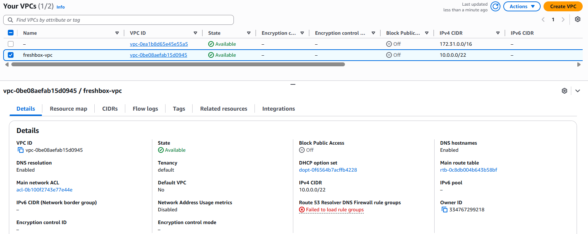

*Figura 2. Detalle de `freshbox-vpc` (`vpc-0be08aefab15d0945`): CIDR 10.0.0.0/22, estado Available. Fuente: `evidencias/01-vpc-subredes/01-vpc-freshbox.png`.*

El Application Load Balancer `freshbox-alb` era internet-facing y estaba asociado a las dos subredes públicas (us-east-1a y us-east-1b); su Target Group `freshbox-tg-app` aplicaba un health check HTTP en la ruta `/` (Amazon Web Services, s.f.-g) y, como muestra la Figura 3, registraba 2 targets en estado `Healthy`, uno en cada zona de disponibilidad. Es evidencia directa de que el tráfico podía seguir siendo atendido si una instancia —no una zona completa— deja de responder.

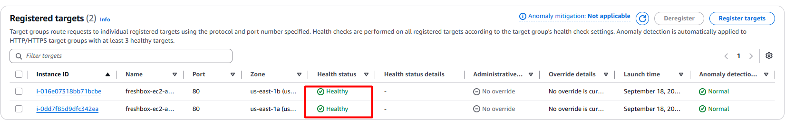

*Figura 3. Target Group `freshbox-tg-app` con 2 targets healthy en zonas de disponibilidad distintas: `i-016e07318bb71bcbe` en us-east-1b e `i-0dd7f85d9dfc342ea` en us-east-1a. Fuente: `evidencias/06-alb-targetgroup/03-targets-healthy.png`.*

En el despliegue verificado el 18 de septiembre de 2026, las instancias de la capa App (`i-016e07318bb71bcbe`, IP privada 10.0.0.253, en la subred `freshbox-sub-app-1b`; e `i-0dd7f85d9dfc342ea`, IP privada 10.0.0.143, en us-east-1a) estaban en estado Running con sus status checks en 3/3, y ambas pertenecían al Auto Scaling Group `freshbox-asg-app`, como muestra la Figura 4. La tercera instancia visible en la lista, `i-096324afebf1a0539`, es la base de datos MariaDB de la capa Data.

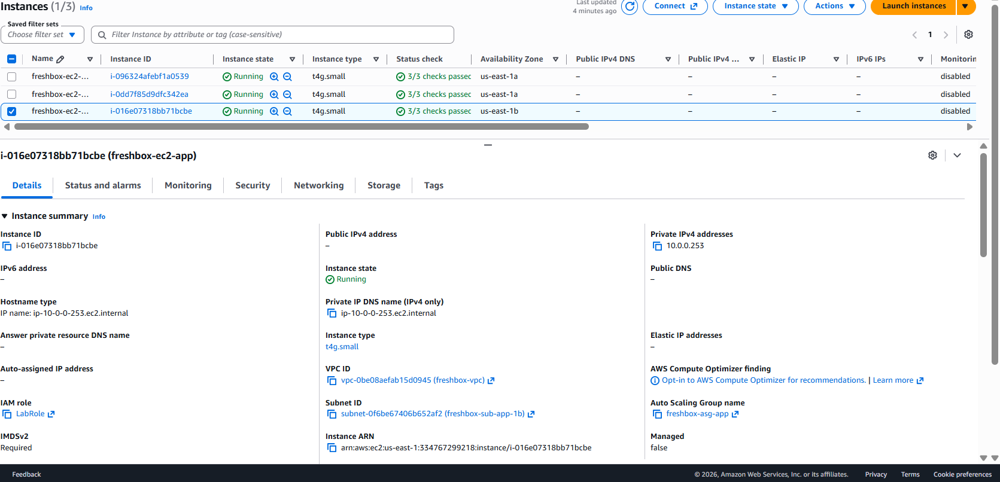

*Figura 4. Instancias EC2 del despliegue: las dos de la capa App del Auto Scaling Group `freshbox-asg-app`, distribuidas en us-east-1b y us-east-1a, y la de la capa Data, todas `t4g.small` con 3/3 status checks; el panel de detalle muestra la pertenencia al grupo. Fuente: `evidencias/04-ec2-app/`.*

Según la bitácora técnica, en el mismo despliegue las instancias originalmente lanzadas por el grupo (`i-0cfb5552cdf4faecc` e `i-0d22849f21e783c74`) fueron reemplazadas por las instancias verificadas sin intervención manual, restituyendo la capacidad deseada de dos instancias healthy, una por zona de disponibilidad. El mecanismo responsable fue el health check de tipo EC2 del grupo, que no se dispara cuando el Target Group marca un target unhealthy por un motivo propio de la aplicación, como se detalla en el punto 1.3.

La continuidad de los datos estaba cubierta por AWS Backup (Amazon Web Services, s.f.-i): el plan `freshbox-backup-plan-mysql` programaba la regla `respaldo-diario-mysql` a las 03:00 UTC, con una ventana de inicio de 60 minutos, una de finalización de 180 minutos y retención de 7 días sobre la instancia `freshbox-ec2-mysql`, como muestra la Figura 5.

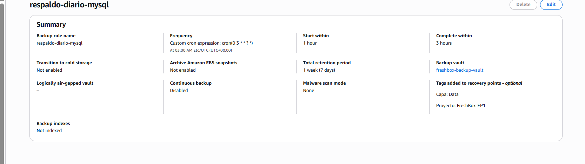

*Figura 5. Plan de respaldo diario `freshbox-backup-plan-mysql`, regla `respaldo-diario-mysql`: frecuencia diaria por expresión cron, retención de 7 días, vault `freshbox-backup-vault`. Fuente: `evidencias/08-aws-backup/01-backup-plan-regla-diaria.png`.*

Una precisión importante sobre este punto: los recovery points de AWS Backup son regionales, no zonales, por lo que un respaldo tomado de la instancia en us-east-1a puede restaurarse en cualquier zona de la región, incluida us-east-1b. La subred `freshbox-sub-data-1b` estaba aprovisionada, pero en el despliegue verificado no alojaba ninguna instancia de base de datos: la restauración en esa zona es una capacidad habilitada por el diseño de red, no algo que se haya ejecutado como prueba de recuperación en este proyecto. Esta distinción importa porque, al ser la base de datos una única instancia EC2 autoadministrada, la disponibilidad de la capa de datos dependía de una sola zona; ante la caída de us-east-1a, el ALB seguiría enrutando tráfico al target sano de 1b, pero ese target no podría completar operaciones porque no hay una instancia de base de datos activa en 1b. Este es precisamente uno de los motivos detrás de la recomendación de migrar a Amazon RDS Multi-AZ (punto 1.3), que sí provisiona automáticamente una réplica en espera en la segunda zona y falla sobre ella sin intervención manual (Amazon Web Services, s.f.-e).

### Validación de escalabilidad

El escalado horizontal quedó definido en `freshbox-asg-app` con mínimo 2, máximo 4 y capacidad deseada 2 instancias, sobre las subredes `freshbox-sub-app-1a` y `freshbox-sub-app-1b`. El aprovisionamiento de una instancia nueva era automático: el UserData del Launch Template instalaba Docker, se autenticaba contra Amazon ECR (Amazon Web Services, s.f.-j) y desplegaba los 5 contenedores apuntando a la IP privada de la instancia de base de datos, sin intervención manual. Las 5 imágenes estaban efectivamente en ECR, como confirma la Figura 6, y las instancias App las descargaron desde ahí durante su aprovisionamiento, lo que verifica que el mecanismo fue ejercitado en la práctica y no solo configurado.

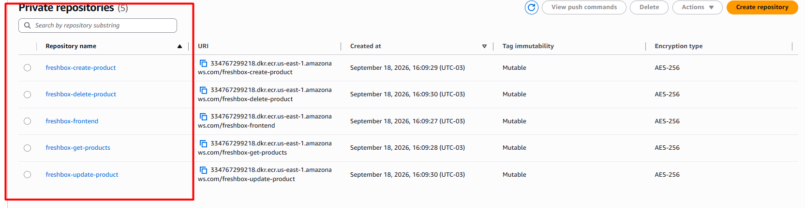

*Figura 6. Los 5 repositorios privados de imágenes en Amazon ECR: `freshbox-frontend` y los cuatro microservicios del CRUD. Fuente: `evidencias/05-ecr/01-repositorios-listado.png`.*

Con esto dicho, hay dos límites que matizan la afirmación de "escalabilidad automática" tal como quedó desplegada. Primero, el rango mín. 2 / máx. 4 es una **capacidad habilitada, no una capacidad activada**: al no existir una política de Target Tracking Scaling asociada, ningún aumento de CPU o de solicitudes por target dispara automáticamente el paso de 2 a 4 instancias; alguien tendría que cambiar la capacidad deseada manualmente. Segundo, los 5 contenedores —incluida la lectura del catálogo y las operaciones de administración— vivían juntos en cada instancia App, y el Auto Scaling Group escala instancias completas, no microservicios individuales; en el despliegue verificado no existía un mecanismo que permita escalar la lectura del catálogo de forma independiente de las operaciones de creación, edición o borrado, aunque la arquitectura de microservicios sí deja esa evolución abierta para etapas futuras.

En cuanto a espacio de crecimiento, la VPC /22 (1.024 direcciones IP) con seis subredes /26 deja rango libre para nuevas subredes y servicios sin necesidad de rediseñar el direccionamiento, una condición favorable para incorporar carrito y órdenes en etapas posteriores sin tocar la red actual.

### Validación de buenas prácticas

La segmentación en tres capas quedó reflejada en dos route tables distintas: `freshbox-rt-public`, asociada a las 2 subredes Web con salida a Internet vía Internet Gateway; y `freshbox-rt-private`, asociada a las 4 subredes App y Data con salida a Internet vía `freshbox-natgw` (Amazon Web Services, s.f.-d). La Figura 7 muestra que, en la consola, `freshbox-rt-private` tenía efectivamente 4 subredes asociadas explícitamente (a) y que el NAT Gateway `freshbox-natgw` estaba en estado Available (b); las rutas `0.0.0.0/0` de cada tabla están definidas en la plantilla `01-red.yaml`. Solo el ALB era internet-facing: ninguna instancia de las capas App o Data tenía IP pública, como se aprecia en las columnas Public IPv4 de la Figura 4.

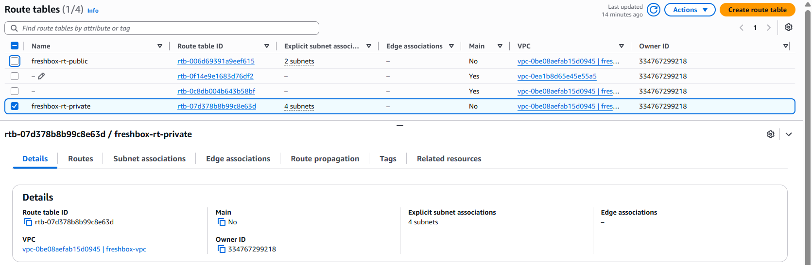

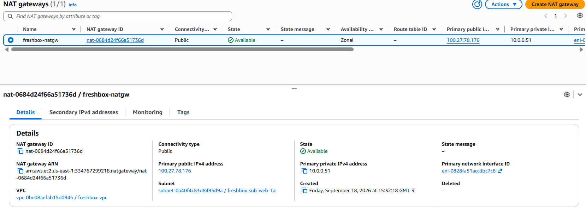

*Figura 7. Route table privada y NAT Gateway: (a) `freshbox-rt-private` (`rtb-07d378b8b99c8e63d`) con 4 subredes asociadas explícitamente, frente a `freshbox-rt-public` con 2; (b) NAT Gateway `freshbox-natgw` en estado Available, con IP elástica pública 100.27.78.176, único punto de salida a Internet de las subredes privadas. Fuente: `evidencias/01-vpc-subredes/10-route-table-privada.png` y `evidencias/01-vpc-subredes/11-nat-gateway.png`.*

Los tres Security Groups —`freshbox-sg-alb`, `freshbox-sg-app` y `freshbox-sg-bd`— existen como recursos independientes, uno por capa, dentro de `freshbox-vpc`. Sus reglas de entrada están definidas en la plantilla `02-security-groups.yaml` referenciando el Security Group de origen en lugar de un rango de IP, por lo que siguen siendo válidas cuando el Auto Scaling Group reemplaza instancias (Amazon Web Services, s.f.-b):

| Security Group | Reglas de entrada definidas en la plantilla | Origen |
|---|---|---|
| `freshbox-sg-alb` | TCP 80 y TCP 443 | `0.0.0.0/0` (tráfico público) |
| `freshbox-sg-app` | TCP 80 y TCP 443 | `SourceSecurityGroupId` = `freshbox-sg-alb` |
| `freshbox-sg-bd` | TCP 3306 | `SourceSecurityGroupId` = `freshbox-sg-app` |

La consola corroboraba ese diseño: el panel de detalle de `freshbox-sg-app` reportaba **2 reglas de entrada** y el de `freshbox-sg-bd` reportaba **1 regla de entrada**, coincidiendo exactamente con lo declarado en la plantilla, como muestran la Figura 8(a) y la Figura 8(b). La descripción de cada grupo documenta además el origen esperado.

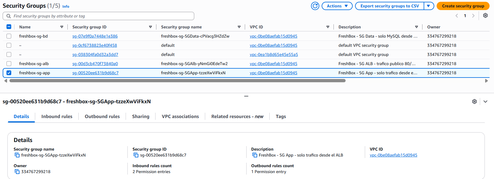

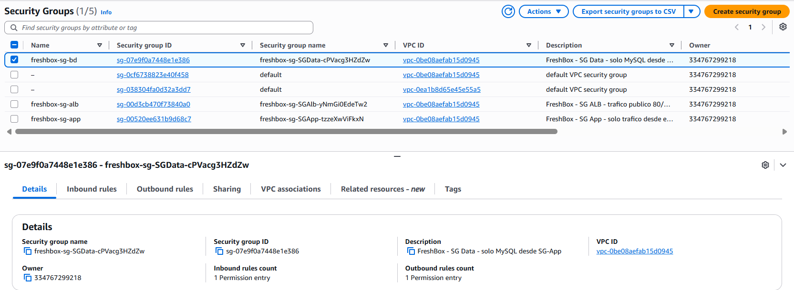

*Figura 8. Security Groups de las capas App y Data: (a) `freshbox-sg-app` (`sg-00520ee631b9d68c7`), 2 reglas de entrada, descripción "solo trafico desde el ALB"; (b) `freshbox-sg-bd` (`sg-07e9f0a7448e1e386`), 1 regla de entrada, descripción "solo MySQL desde SG-App". Fuente: `evidencias/02-security-groups/02-sg-app-detalle.png` y `evidencias/02-security-groups/03-sg-bd-detalle.png`.*

Los volúmenes EBS de las capas App y Data estaban cifrados (`Encrypted: true` en las plantillas de cómputo); la administración fue exclusivamente por SSM Session Manager, sin llaves SSH, y no existía ninguna regla de entrada al puerto 22 en los Security Groups; el rol de las instancias tenía permiso de solo lectura sobre ECR, mientras que el push de imágenes se realizó desde una identidad distinta; y la infraestructura completa es auditable y reproducible como código en los 5 stacks de CloudFormation (Amazon Web Services, s.f.-k).

Finalmente, la validación funcional end-to-end del CRUD de productos —crear, listar, editar y eliminar— se realizó a través del DNS público del ALB desde la interfaz web, ejercitando los cuatro métodos (GET, POST, PUT y DELETE), y quedó registrada en la secuencia de capturas de la Figura 9; los endpoints también se ejercitaron por API durante el desarrollo, sin que esa prueba quedara documentada como evidencia. La secuencia muestra el listado inicial con los 5 productos originales, creación de un producto nuevo (id 7, "NARANAX") y listado final tras eliminarlo, mostrando que se recupera exactamente el estado original. Esto confirma simultáneamente que la segmentación de red, los Security Groups encadenados y la corrección del primer defecto de la aplicación (rutas relativas de API) funcionaron en conjunto, y no solo en la teoría del diseño.

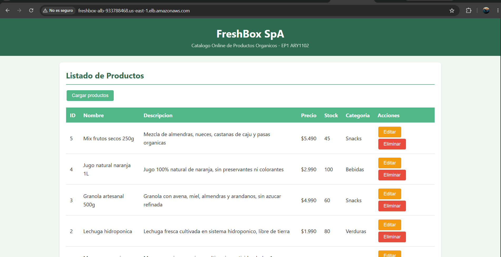

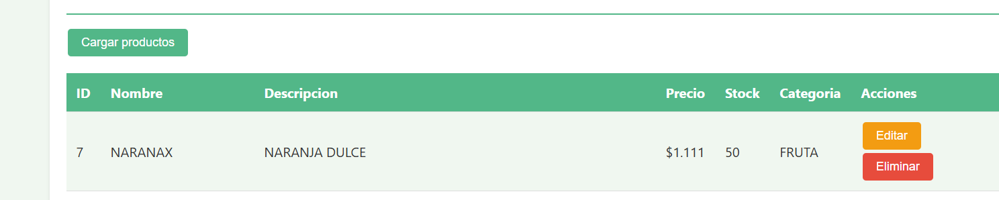

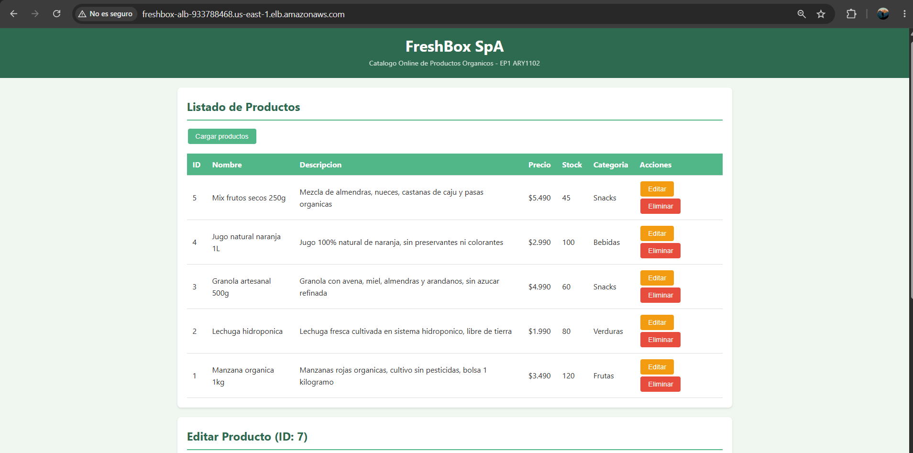

*Figura 9. Validación CRUD end-to-end a través del ALB, vía el frontend web: (a) listado inicial con 5 productos, (b) producto creado vía POST ("NARANAX", id 7) y (c) listado final tras el DELETE, de vuelta al estado original. Fuente: `evidencias/07-validacion-crud/`.*

### Tabla de trazabilidad: requerimiento, componente y evidencia

Para cerrar el círculo entre lo declarado en el punto 1.4 y lo efectivamente desplegado y verificado, la siguiente tabla vincula cada requerimiento de prioridad Alta o Media ya implementado con el componente de AWS que lo satisface, el método de validación aplicado y la evidencia concreta que lo respalda.

| Requerimiento | Componente AWS que lo implementa | Cómo se validó | Evidencia |
|---|---|---|---|
| R01 / R02 CRUD del catálogo | 4 microservicios Node.js tras el ALB | GET/POST/PUT/DELETE end-to-end por DNS público, vía interfaz web | Figura 9 · `evidencias/07-validacion-crud/` |
| R03 Alta disponibilidad Multi-AZ | ALB + ASG en us-east-1a / us-east-1b | Target Group con 2 targets healthy en AZs distintas | Figura 3 · `evidencias/06-alb-targetgroup/` |
| R04 Escalabilidad automática | ASG `freshbox-asg-app` (mín. 2 / máx. 4) + Amazon ECR | Rango de capacidad verificado en la plantilla; descarga de imágenes desde ECR ejercitada en el aprovisionamiento | Figura 6 · `infra/03-compute.yaml` |
| R05 Aislamiento de red por capas | 3 Security Groups encadenados + 2 route tables | Conteo de reglas de entrada en consola coincidente con la plantilla; separación de route table pública/privada | Figuras 7 y 8 · `infra/02-security-groups.yaml` |
| R06 BD aislada de Internet | Subred privada Data + `SG-bd` (3306 solo desde `SG-app`) | Regla única de entrada en `SG-bd`; ausencia de IP pública en la instancia de datos | Figuras 4 y 8(b) |
| R07 Cifrado de datos en reposo | Volúmenes EBS gp3 cifrados | `Encrypted: true` en el Launch Template y en la instancia de datos | `infra/03-compute.yaml` |
| R08 Respaldo y recuperación | Plan `freshbox-backup-plan-mysql` en `freshbox-backup-vault` | Regla diaria a las 03:00 UTC y retención de 7 días configuradas | Figura 5 · `evidencias/08-aws-backup/` |
| R09 Salida controlada a Internet | NAT Gateway `freshbox-natgw` | Route table privada con 4 subredes asociadas y NAT en estado Available | Figura 7 |
| R10 Despliegue reproducible (IaC) | 5 stacks de CloudFormation | Plantillas versionadas en el repositorio, con runbook de redespliegue | `infra/` · `notas/bitacora.md` |
| R11 Portabilidad de la aplicación | Docker + Amazon ECR (5 repositorios) | Verificación de los 5 repositorios y de la descarga de imágenes por las instancias App | Figura 6 |
| R12 Administración sin exponer SSH | AWS Systems Manager Session Manager | `LabInstanceProfile` con permisos SSM; sin regla de entrada al puerto 22 en los Security Groups | `infra/03-compute.yaml` · Figura 8 |
| R13 Optimización de costos | Graviton `t4g.small` + elasticidad del ASG | Tipo de instancia verificado en consola para las 3 instancias | Figura 4 |

Las brechas conocidas del diseño verificado —ausencia de listener HTTPS en el ALB, NAT Gateway único en us-east-1a, base de datos autoadministrada en una sola instancia EC2, Auto Scaling Group sin política de escalado dinámico, `HealthCheckType` EC2 en lugar de `ELB`, ausencia de observabilidad y dependencia de la IP privada de la base de datos inyectada en el UserData— se desarrollan, cada una con su recomendación específica, en la tabla del punto 1.3. Declararlas, en lugar de presentar la arquitectura como si no tuviera limitaciones, es precisamente el criterio que se espera de un arquitecto cloud: cada una responde a una restricción real del entorno académico o al alcance explícito de esta etapa del proyecto.

---

# Conclusiones

La arquitectura desplegada para FreshBox SpA responde de manera verificable a las cinco necesidades declaradas por la organización: visualización y administración de productos mediante un CRUD validado de extremo a extremo, escalabilidad habilitada mediante un Auto Scaling Group Multi-AZ, alta disponibilidad soportada por un Application Load Balancer y dos zonas de disponibilidad, y optimización operacional y financiera mediante infraestructura como código, procesadores Graviton y un modelo de pago por uso.

El trabajo de arquitectura no se limitó a diseñar sobre el papel: se tradujo en una infraestructura real, con identificadores de recursos verificables, y se validó funcionalmente. Esa validación también dejó a la vista los límites del diseño actual —un solo NAT Gateway, una base de datos sin réplica automática, un Auto Scaling Group sin política de escalado dinámico ni health check ligado al balanceador, ausencia de HTTPS y de observabilidad—, todos declarados explícitamente junto con su recomendación de mejora en los puntos 1.3 y 1.7, en lugar de presentarse como un diseño sin limitaciones.

Un aprendizaje transversal del proyecto merece destacarse: el mecanismo de recuperación automática del Auto Scaling Group funcionó y mantuvo el servicio disponible, pero la ausencia de observabilidad impidió reconstruir con precisión qué evento lo activó. Una plataforma puede ser resiliente y al mismo tiempo opaca; la resiliencia protege al usuario, mientras que la observabilidad protege la capacidad del equipo de entender y mejorar el sistema. Ambas son necesarias, y esa es la primera mejora que este diseño debería incorporar antes de operar en producción.

La decisión de adoptar un modelo de nube pública sobre AWS, en lugar de uno privado o híbrido, resultó ser la opción adecuada dado el tamaño de la empresa, su ritmo de crecimiento y la ausencia de infraestructura previa que migrar o de un requisito regulatorio de residencia de datos. Esa decisión se sostiene en tres planos —técnico, financiero y estratégico— y no solo en la conveniencia técnica de los servicios gestionados de AWS.

Como arquitectura base para el catálogo de productos, el diseño deja además una red con espacio de direccionamiento libre y una base de microservicios en contenedores que permiten incorporar, en etapas posteriores, el carrito de compras y el procesamiento de órdenes sin necesidad de rediseñar la topología de red actual.

---

# Bibliografía

Amazon Web Services. (s.f.-a). *The pillars of the framework*. AWS Well-Architected Framework. Recuperado el 19 de septiembre de 2026, de https://docs.aws.amazon.com/wellarchitected/latest/framework/the-pillars-of-the-framework.html

Amazon Web Services. (s.f.-b). *Control traffic to your AWS resources using security groups*. Amazon VPC User Guide. Recuperado el 19 de septiembre de 2026, de https://docs.aws.amazon.com/vpc/latest/userguide/VPC_SecurityGroups.html

Amazon Web Services. (s.f.-c). *AWS Graviton Processors*. Recuperado el 19 de septiembre de 2026, de https://aws.amazon.com/ec2/graviton/

Amazon Web Services. (s.f.-d). *NAT gateway basics*. Amazon VPC User Guide. Recuperado el 19 de septiembre de 2026, de https://docs.aws.amazon.com/vpc/latest/userguide/nat-gateway-basics.html

Amazon Web Services. (s.f.-e). *Multi-AZ DB instance deployments for Amazon RDS*. Amazon RDS User Guide. Recuperado el 19 de septiembre de 2026, de https://docs.aws.amazon.com/AmazonRDS/latest/UserGuide/Concepts.MultiAZSingleStandby.html

Amazon Web Services. (s.f.-f). *Shared Responsibility Model*. Recuperado el 19 de septiembre de 2026, de https://aws.amazon.com/compliance/shared-responsibility-model/

Amazon Web Services. (s.f.-g). *What is an Application Load Balancer?* Elastic Load Balancing User Guide. Recuperado el 19 de septiembre de 2026, de https://docs.aws.amazon.com/elasticloadbalancing/latest/application/introduction.html

Amazon Web Services. (s.f.-h). *Health checks for instances in an Auto Scaling group*. Amazon EC2 Auto Scaling User Guide. Recuperado el 19 de septiembre de 2026, de https://docs.aws.amazon.com/autoscaling/ec2/userguide/ec2-auto-scaling-health-checks.html

Amazon Web Services. (s.f.-i). *What is AWS Backup?* AWS Backup Developer Guide. Recuperado el 19 de septiembre de 2026, de https://docs.aws.amazon.com/aws-backup/latest/devguide/whatisbackup.html

Amazon Web Services. (s.f.-j). *What is Amazon Elastic Container Registry?* Amazon ECR User Guide. Recuperado el 19 de septiembre de 2026, de https://docs.aws.amazon.com/AmazonECR/latest/userguide/what-is-ecr.html

Amazon Web Services. (s.f.-k). *What is CloudFormation?* AWS CloudFormation User Guide. Recuperado el 19 de septiembre de 2026, de https://docs.aws.amazon.com/AWSCloudFormation/latest/UserGuide/Welcome.html

Mell, P., & Grance, T. (2011). *The NIST Definition of Cloud Computing* (NIST Special Publication 800-145). National Institute of Standards and Technology. https://doi.org/10.6028/NIST.SP.800-145

*Nota: las entradas marcadas "s.f." corresponden a documentación técnica de referencia de Amazon Web Services sin fecha de publicación individual atribuible; todas fueron verificadas y accedidas el 19 de septiembre de 2026 en las URL indicadas.*
